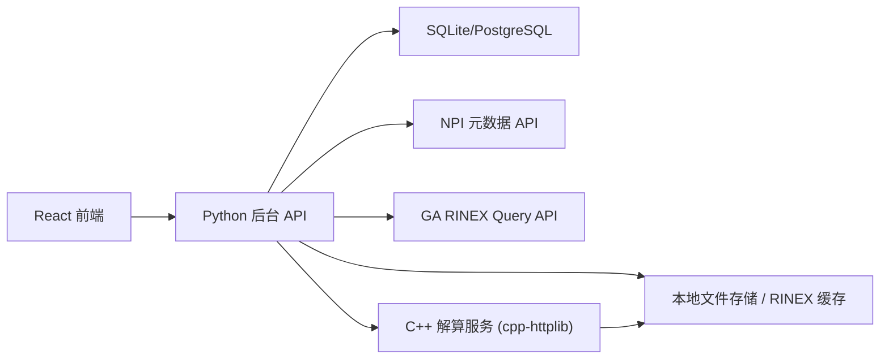

# GNSS 参考站管理与解算系统设计

## 1. 设计目标

本系统分为三个模块：

1. 前端 Web 应用：面向用户完成站网管理、RINEX 文件查询、解算任务提交与结果展示。
2. Python 后台：提供统一业务 API，负责本地数据管理、外部数据抓取、RINEX 下载编目、任务调度、结果聚合。
3. C++ 解算服务：基于本地 RINEX 观测值和导航电文完成 SPP、RTD、RTK 解算，并通过 HTTP 输出结果。

约束与原则：

- 初始参考站网数据来自澳大利亚 NPI 元数据服务：
  - 子网：`https://metadata.gnss.ga.gov.au/api/corsNetworks`
  - 站点：`https://metadata.gnss.ga.gov.au/api/corsSites`
- 程序启动时完成首次拉取并存入本地。
- 后续用户对网络、站点的新增、修改、删除都只作用于本地副本，不回写 NPI。
- 观测数据不使用 NPI NTRIP，而是按需查询并下载 RINEX 文件。
- 解算功能不依赖 RTKLIB 等第三方解算库，需自研以下能力：
  - RINEX 2/3/4 解析
  - CRX/Hatanaka、gzip 等压缩格式处理
  - 坐标系统与时间系统转换
  - 星历解析与卫星位置计算
  - 单点定位、差分定位、平差与质量评估
- 架构需为未来扩展预留空间：
  - PPP/SPP 增强模型
  - 差分后处理
  - 多机并行计算
  - 作为 nginx 模块的可能性

## 2. 外部数据源与本地化策略

### 2.1 外部数据源

1. 元数据
   - `GET https://metadata.gnss.ga.gov.au/api/corsNetworks`
   - `GET https://metadata.gnss.ga.gov.au/api/corsSites`
   - 这两个接口为分页 HAL 风格 JSON，站点包含 `networkTenancies`，可用于重建“子网-站点”关系。
2. RINEX 文件目录与下载
   - `GET https://data.gnss.ga.gov.au/api/rinexFiles`
   - 根据站点、时间范围、文件类型、RINEX 版本等条件查询可下载文件，再根据返回的 `fileLocation` 下载。

### 2.2 本地化原则

本地数据采用“基线快照 + 本地业务实体”的双层模型：

- `import_batches` / `external_*_snapshots` 保存每次从 NPI 获取的原始快照，保证可追溯。
- `networks` / `sites` / `network_site_memberships` 作为系统实际使用的业务表。
- 首次启动时，业务表由 NPI 快照初始化。
- 后续本地编辑只修改业务表，同时记录审计日志。
- 如未来需要重新同步 NPI，仅生成新快照，并通过“同步预览 + 手工合并”更新业务表，避免覆盖本地人工修改。

## 3. 总体架构

## 3.1 逻辑分层



### 3.2 模块职责

#### 前端

- 子网和站点元数据管理
- 站点观测文件查询与下载触发
- 解算任务创建、进度查看、结果可视化
- 站点状态与卫星状态的历史分析

#### Python 后台

- 启动初始化与 NPI 数据导入
- 本地元数据 CRUD
- RINEX 文件查询、下载、缓存、索引
- 解算任务编排与结果聚合
- 将前端友好对象映射为解算服务请求
- 用户操作审计、任务历史、状态统计

#### C++ 解算服务

- RINEX/CRX/gz 解析与标准化读取
- 时间系统、坐标系统、卫星状态计算
- SPP、RTD、RTK 解算
- 残差、DOP、卫星使用情况、模糊度状态等结果生成
- 统一 HTTP 服务接口，未来可抽离为 nginx 模块

## 4. 推荐技术选型

### 4.1 前端

- React + TypeScript + Vite
- React Router
- TanStack Query
- Ant Design 或 MUI 作为表单/表格基础组件
- ECharts 负责时间序列、残差、卫星状态图
- MapLibre GL JS 负责站点地图与轨迹展示

### 4.2 Python 后台

- FastAPI
- SQLAlchemy + Alembic
- SQLite 作为默认单机存储，数据库层保留 PostgreSQL 兼容
- Pydantic 作为接口模型
- 后台任务执行采用“任务队列抽象层”
  - 初版可用进程内 worker pool
  - 后续可替换为 Redis/Celery/RQ

### 4.3 C++ 解算服务

- C++20
- CMake
- `cpp-httplib` 作为 HTTP 接入层
- 核心算法封装为独立静态/动态库，HTTP 只是适配层

## 5. 核心业务流程

### 5.1 首次启动初始化

1. 后台启动。
2. 检查本地数据库是否已有初始化批次。
3. 若无，则分页拉取 `corsNetworks` 和 `corsSites`。
4. 保存原始快照。
5. 转换为本地业务实体：
   - 子网
   - 站点
   - 子网与站点的归属关系
6. 标记系统为 `bootstrapped=true`。

### 5.2 RINEX 查询与下载

1. 前端按站点、日期范围、文件周期、文件类型发起查询。
2. 后台先查本地 `rinex_files` 编目。
3. 若无或要求刷新，则调用 GA 的 `rinexFiles` 查询接口。
4. 后台保存远端清单，并根据用户操作下载文件到本地。
5. 下载后触发文件检查与索引：
   - 文件名规范解析
   - 压缩类型识别
   - RINEX 头部扫描
   - 时间覆盖范围、采样率、星座支持情况、观测类型索引

### 5.3 解算任务执行

1. 前端选择解算模式：
   - 单站任意时刻 SPP
   - 指定参考站与多个流动站 RTD
   - 指定参考站与多个流动站 RTK
2. 后台校验输入与文件可用性。
3. 后台向 C++ 解算服务提交任务。
4. 解算服务读取本地 RINEX/导航文件并执行算法。
5. 后台接收结果并落库。
6. 前端查询结果摘要、历元结果、卫星状态、历史趋势。

## 6. 本地数据模型

## 6.1 元数据实体

### `networks`

- `id`
- `source_type`：`npi_seed` / `local`
- `external_id`
- `name`
- `description`
- `status`
- `created_at`
- `updated_at`
- `last_import_batch_id`
- `is_deleted`

### `sites`

- `id`
- `source_type`
- `external_id`
- `name`
- `four_char_id`
- `domes_number`
- `description`
- `latitude`
- `longitude`
- `ellipsoidal_height`
- `date_installed`
- `site_status`
- `monument_description`
- `monument_foundation`
- `marker_description`
- `monument_height`
- `geologic_characteristic`
- `bedrock_type`
- `created_at`
- `updated_at`
- `last_import_batch_id`
- `is_deleted`

### `network_site_memberships`

- `id`
- `network_id`
- `site_id`
- `valid_from`
- `valid_to`
- `source_type`
- `created_at`
- `updated_at`

### `entity_audit_logs`

- `id`
- `entity_type`
- `entity_id`
- `action`
- `before_json`
- `after_json`
- `operator`
- `created_at`

## 6.2 RINEX 与导航数据实体

### `rinex_files`

- `id`
- `site_id`
- `source`：`ga_remote` / `local_upload`
- `remote_file_id`
- `remote_url`
- `filename`
- `local_path`
- `file_type`：`obs` / `nav` / `met`
- `file_period`：`01D` / `01H` / `15M`
- `rinex_version`
- `compression_type`：`none` / `gz` / `crx.gz` / `zip`
- `sample_interval_seconds`
- `start_time`
- `end_time`
- `file_size`
- `download_status`
- `index_status`
- `metadata_status`
- `created_at`
- `updated_at`

### `rinex_file_indexes`

- `id`
- `rinex_file_id`
- `constellations`
- `observation_types_json`
- `epoch_count`
- `has_navigation_message`
- `header_json`
- `quality_flags_json`

## 6.3 解算任务与结果实体

### `solve_jobs`

- `id`
- `job_type`：`spp` / `rtd` / `rtk`
- `status`：`queued` / `running` / `succeeded` / `failed` / `cancelled`
- `request_json`
- `solver_job_id`
- `started_at`
- `finished_at`
- `error_message`
- `created_at`

### `solve_results`

- `id`
- `job_id`
- `summary_json`
- `quality_json`
- `baseline_json`
- `created_at`

### `solution_epochs`

- `id`
- `job_id`
- `epoch_time`
- `site_role`：`base` / `rover` / `single`
- `solution_status`：`invalid` / `float` / `fix` / `code`
- `x`
- `y`
- `z`
- `latitude`
- `longitude`
- `height`
- `pdop`
- `hdop`
- `vdop`
- `nsat_used`
- `sigma0`
- `residual_summary_json`

### `satellite_state_samples`

- `id`
- `job_id`
- `epoch_time`
- `satellite_system`
- `satellite_prn`
- `elevation_deg`
- `azimuth_deg`
- `snr`
- `used_in_solution`
- `health_status`
- `cycle_slip_detected`
- `residual_code`
- `residual_phase`

## 7. 前端功能设计

## 7.1 页面与模块

### 1. 总览页

- 站网数量、站点数量、已下载 RINEX 数量、最近解算任务
- 站点地图概览
- 数据同步状态、解算服务健康状态

### 2. 子网管理

- 子网列表
- 子网详情
- 新增子网
- 编辑子网
- 删除子网
- 查看子网下站点
- 批量将站点加入/移出子网

### 3. 站点管理

- 站点列表
- 条件筛选：四字符码、DOMES、子网、状态、时间范围
- 站点详情
- 新增站点
- 编辑站点
- 删除站点
- 站点归属子网维护
- 元数据历史记录查看

### 4. 观测数据查询

- 按站点、日期范围、文件周期、文件类型查询 RINEX
- 显示远端可下载文件与本地缓存文件
- 下载任务触发
- 文件详情查看：
  - RINEX 版本
  - 采样率
  - 覆盖时段
  - 支持星座
  - 观测值类型

### 5. 解算任务中心

- 创建 SPP 任务
- 创建 RTD 任务
- 创建 RTK 任务
- 查看任务队列、运行状态、错误原因
- 复用已有 RINEX 文件重新解算

### 6. 解算结果展示

- 历元级位置结果表
- 地图轨迹/散点图
- 坐标偏差时序图
- DOP、卫星数量、残差时序图
- 基站/流动站基线长度与变化
- RTK 固定率、浮点率、失锁统计
- 指定时刻的卫星可见性与参与解算状态
- 历史任务对比

### 7. 站点与卫星状态分析

- 站点历史状态
  - 观测缺口
  - 文件覆盖率
  - 解算可用率
  - 固定率
- 卫星历史状态
  - 可见/参与/剔除趋势
  - 仰角、方位角、SNR、残差
  - 周跳、健康状态

## 8. Python 后台服务接口

接口统一前缀：`/api/v1`

返回结构统一建议：

```json
{
  "code": "OK",
  "message": "success",
  "data": {},
  "meta": {}
}
```

## 8.1 系统与初始化接口

| 方法 | 路径 | 说明 |
| --- | --- | --- |
| `GET` | `/system/health` | 返回后台、数据库、文件存储、解算服务健康状态 |
| `GET` | `/system/bootstrap-status` | 返回是否已完成初始化、最近导入批次、站点/子网数量 |
| `POST` | `/system/bootstrap` | 执行首次初始化；若已初始化则返回当前状态 |
| `POST` | `/system/sync/npi/preview` | 重新抓取 NPI 数据并生成差异预览，不直接覆盖本地数据 |
| `POST` | `/system/sync/npi/apply` | 根据预览结果应用同步策略，支持只新增、更新未修改项等策略 |
| `GET` | `/system/capabilities` | 返回系统支持的星座、解算模式、文件格式、平台信息 |

### `/system/bootstrap` 请求体

```json
{
  "force": false
}
```

### `/system/bootstrap` 返回重点

- 导入批次 ID
- 导入的网络数量
- 导入的站点数量
- 导入耗时

## 8.2 子网管理接口

| 方法 | 路径 | 说明 |
| --- | --- | --- |
| `GET` | `/networks` | 查询子网列表，支持分页、关键字、来源、状态筛选 |
| `POST` | `/networks` | 新增本地子网 |
| `GET` | `/networks/{networkId}` | 查询子网详情 |
| `PATCH` | `/networks/{networkId}` | 修改子网名称、描述、状态 |
| `DELETE` | `/networks/{networkId}` | 逻辑删除子网 |
| `GET` | `/networks/{networkId}/sites` | 查询子网下站点列表 |
| `POST` | `/networks/{networkId}/sites` | 将一个或多个站点加入子网 |
| `DELETE` | `/networks/{networkId}/sites/{siteId}` | 将站点移出子网 |

### `GET /networks` 查询参数

- `page`
- `pageSize`
- `keyword`
- `sourceType`
- `status`
- `includeSiteCount`

### `POST /networks` 请求体

```json
{
  "name": "TEST-NET",
  "description": "本地测试子网",
  "status": "active"
}
```

### `POST /networks/{networkId}/sites` 请求体

```json
{
  "siteIds": [101, 102, 103],
  "validFrom": "2026-04-26T00:00:00Z",
  "validTo": null
}
```

## 8.3 站点管理接口

| 方法 | 路径 | 说明 |
| --- | --- | --- |
| `GET` | `/sites` | 查询站点列表 |
| `POST` | `/sites` | 新增本地站点 |
| `GET` | `/sites/{siteId}` | 查询站点详情 |
| `PATCH` | `/sites/{siteId}` | 修改站点元数据 |
| `DELETE` | `/sites/{siteId}` | 逻辑删除站点 |
| `GET` | `/sites/{siteId}/networks` | 查询站点所属子网 |
| `GET` | `/sites/{siteId}/history` | 查询站点元数据变更历史 |
| `GET` | `/sites/{siteId}/observation-summary` | 查询站点在时间范围内的文件覆盖与观测摘要 |
| `GET` | `/sites/{siteId}/status-history` | 查询站点历史解算可用率、固定率、数据完整性等指标 |

### `GET /sites` 查询参数

- `page`
- `pageSize`
- `keyword`
- `fourCharId`
- `domesNumber`
- `networkId`
- `siteStatus`
- `sourceType`
- `bbox`
- `includeNetworkNames`

### `POST /sites` 请求体

```json
{
  "name": "Local Test Site",
  "fourCharId": "LTS1",
  "domesNumber": "LOCAL000001",
  "description": "本地新增站点",
  "approximatePosition": {
    "latitude": -35.123,
    "longitude": 149.123,
    "ellipsoidalHeight": 620.5
  },
  "dateInstalled": "2026-04-26T00:00:00Z",
  "siteStatus": "PUBLIC",
  "monument": {
    "description": "PILLAR",
    "foundation": "CONCRETE",
    "markerDescription": "THREAD",
    "height": "1.2"
  }
}
```

## 8.4 RINEX 查询、下载与文件管理接口

| 方法 | 路径 | 说明 |
| --- | --- | --- |
| `GET` | `/rinex-files` | 查询本地已索引文件，可选联动远端刷新 |
| `POST` | `/rinex-files/query-remote` | 调用 GA RINEX Query API 查询远端可用文件 |
| `POST` | `/rinex-files/download` | 将远端文件下载到本地缓存 |
| `GET` | `/rinex-files/{rinexFileId}` | 查询文件详情与索引结果 |
| `GET` | `/rinex-files/{rinexFileId}/header` | 返回 RINEX 头部解析结果 |
| `GET` | `/rinex-files/{rinexFileId}/epochs` | 返回文件时间覆盖、采样率、历元概览 |
| `POST` | `/rinex-files/reindex` | 重新索引一个或多个本地文件 |
| `DELETE` | `/rinex-files/{rinexFileId}` | 删除本地缓存文件和索引，不影响业务站点元数据 |

### `POST /rinex-files/query-remote` 请求体

```json
{
  "siteIds": ["ALIC", "STR1"],
  "startDate": "2026-03-01T00:00:00Z",
  "endDate": "2026-03-02T00:00:00Z",
  "filePeriod": ["01D", "01H"],
  "fileType": ["obs", "nav"],
  "rinexVersion": ["2", "3", "4"],
  "metadataStatus": "all",
  "decompress": false
}
```

### `POST /rinex-files/download` 请求体

```json
{
  "items": [
    {
      "siteId": "ALIC",
      "remoteFileId": "e411e109-713d-4a9d-8d04-f0758bddb4ce",
      "remoteUrl": "https://..."
    }
  ],
  "overwrite": false,
  "autoIndex": true
}
```

### `GET /sites/{siteId}/observation-summary` 查询参数

- `startTime`
- `endTime`
- `filePeriod`
- `fileType`
- `withRemote`

返回重点：

- 本地文件数量
- 远端文件数量
- 覆盖时间段
- 缺口时间段
- 可用星座

## 8.5 解算任务接口

| 方法 | 路径 | 说明 |
| --- | --- | --- |
| `GET` | `/solve-jobs` | 查询解算任务列表 |
| `POST` | `/solve-jobs/spp` | 创建单站单点定位任务 |
| `POST` | `/solve-jobs/differential` | 创建差分定位任务，模式可选 `rtd` 或 `rtk` |
| `GET` | `/solve-jobs/{jobId}` | 查询任务状态与摘要 |
| `DELETE` | `/solve-jobs/{jobId}` | 取消尚未完成的任务 |
| `GET` | `/solve-jobs/{jobId}/result` | 查询最终结果摘要 |
| `GET` | `/solve-jobs/{jobId}/epochs` | 查询历元级结果 |
| `GET` | `/solve-jobs/{jobId}/satellites` | 查询卫星状态序列 |
| `GET` | `/solve-jobs/{jobId}/sites` | 查询任务中各站点角色和质量统计 |
| `GET` | `/solve-jobs/{jobId}/logs` | 查询求解日志和告警信息 |

### `POST /solve-jobs/spp` 请求体

```json
{
  "siteId": 6315,
  "observationFileId": 10001,
  "navigationFileIds": [20001],
  "epochTime": "2026-03-01T12:00:00Z",
  "constellations": ["GPS", "BDS", "GAL", "GLO"],
  "elevationMaskDeg": 10,
  "models": {
    "ionosphere": "broadcast",
    "troposphere": "saastamoinen",
    "earthRotation": true,
    "relativity": true
  }
}
```

### `POST /solve-jobs/differential` 请求体

```json
{
  "mode": "rtk",
  "baseSiteId": 6315,
  "baseObservationFileId": 10001,
  "baseNavigationFileIds": [20001],
  "rovers": [
    {
      "siteId": 6308,
      "observationFileId": 10011
    },
    {
      "siteId": 897,
      "observationFileId": 10021
    }
  ],
  "timeWindow": {
    "start": "2026-03-01T12:00:00Z",
    "end": "2026-03-01T12:30:00Z"
  },
  "epochIntervalSeconds": 1,
  "constellations": ["GPS", "BDS", "GAL", "GLO"],
  "options": {
    "ambiguityResolution": "lambda",
    "minCommonSatellites": 5,
    "elevationMaskDeg": 10,
    "solutionOutputIntervalSeconds": 1
  }
}
```

### `GET /solve-jobs/{jobId}/result` 返回重点

- 解算模式、参考站、流动站
- 结果状态：`code` / `float` / `fix`
- 首次固定时间、固定率、可用率
- 平均/最大三维误差
- 基线长度统计
- 历元总数、有效历元数

## 8.6 历史状态分析接口

| 方法 | 路径 | 说明 |
| --- | --- | --- |
| `GET` | `/analytics/site-availability` | 按站点统计文件覆盖率、解算可用率、固定率 |
| `GET` | `/analytics/site-epochs` | 查询某站点历史历元质量统计 |
| `GET` | `/analytics/satellite-history` | 查询某颗卫星在时间范围内的仰角、SNR、残差、健康状态 |
| `GET` | `/analytics/network-overview` | 查询子网内站点数量、下载文件数量、近期任务成功率 |

## 9. C++ 解算服务接口

接口前缀建议：`/solver/v1`

说明：

- Python 后台是解算服务的主要调用方，前端不直接访问该服务。
- 解算服务保持“无业务状态”，任务状态仅围绕求解过程，用户态历史与审计由 Python 后台保存。
- 大文件默认不经 HTTP 上传原始字节，而是传递本地文件路径或文件 URI；如未来拆分部署，可扩展为 HTTP 下载或对象存储 URI。

## 9.1 解算服务公共接口

| 方法 | 路径 | 说明 |
| --- | --- | --- |
| `GET` | `/health` | 进程健康检查 |
| `GET` | `/capabilities` | 返回支持的星座、格式、算法、模型 |
| `POST` | `/files/inspect` | 检查并解析文件头，返回文件类型、时间范围、观测类型 |
| `GET` | `/jobs/{jobId}` | 查询任务运行状态 |
| `DELETE` | `/jobs/{jobId}` | 取消任务 |
| `GET` | `/jobs/{jobId}/result` | 查询结果摘要 |
| `GET` | `/jobs/{jobId}/epochs` | 查询历元级结果 |
| `GET` | `/jobs/{jobId}/satellites` | 查询卫星状态结果 |

## 9.2 单点定位接口

| 方法 | 路径 | 说明 |
| --- | --- | --- |
| `POST` | `/solve/spp` | 对一个站点指定时刻或指定时间窗进行 SPP 解算 |

### `POST /solve/spp` 请求体

```json
{
  "jobId": "job-spp-0001",
  "site": {
    "siteId": 6315,
    "name": "ADEL"
  },
  "observation": {
    "filePath": "/data/rinex/ADEL00AUS_R_20260600000_01D_30S_MO.crx.gz",
    "rinexVersion": "3"
  },
  "navigation": [
    {
      "filePath": "/data/rinex/BRDC00IGS_R_20260600000_01D_MN.rnx.gz"
    }
  ],
  "time": {
    "mode": "epoch",
    "epoch": "2026-03-01T12:00:00Z"
  },
  "constellations": ["GPS", "BDS", "GAL", "GLO"],
  "models": {
    "ionosphere": "broadcast",
    "troposphere": "saastamoinen",
    "weighting": "elevation"
  }
}
```

## 9.3 差分定位接口

| 方法 | 路径 | 说明 |
| --- | --- | --- |
| `POST` | `/solve/differential` | 差分定位任务，支持 `rtd` 和 `rtk` |

### `POST /solve/differential` 请求体

```json
{
  "jobId": "job-rtk-0001",
  "mode": "rtk",
  "base": {
    "siteId": 6315,
    "observationFilePath": "/data/rinex/base.crx.gz",
    "navigationFilePaths": [
      "/data/rinex/brdc.rnx.gz"
    ],
    "approximatePosition": {
      "x": -3921710.0,
      "y": 3468810.0,
      "z": -3639000.0
    }
  },
  "rovers": [
    {
      "siteId": 6308,
      "observationFilePath": "/data/rinex/rover1.crx.gz"
    },
    {
      "siteId": 897,
      "observationFilePath": "/data/rinex/rover2.crx.gz"
    }
  ],
  "timeWindow": {
    "start": "2026-03-01T12:00:00Z",
    "end": "2026-03-01T12:30:00Z"
  },
  "processing": {
    "epochIntervalSeconds": 1,
    "elevationMaskDeg": 10,
    "ambiguityResolution": "lambda",
    "minCommonSatellites": 5
  }
}
```

## 9.4 解算服务结果结构

### 任务摘要

```json
{
  "jobId": "job-rtk-0001",
  "status": "succeeded",
  "mode": "rtk",
  "summary": {
    "epochCount": 1800,
    "validEpochCount": 1724,
    "fixEpochCount": 1580,
    "floatEpochCount": 144,
    "availabilityRate": 0.9578,
    "fixRate": 0.8801
  }
}
```

### 历元结果字段

- `epochTime`
- `siteId`
- `solutionStatus`
- `ecef`
- `geodetic`
- `baseline`
- `nsatTracked`
- `nsatUsed`
- `pdop`
- `residualRms`
- `ambiguityState`

### 卫星状态字段

- `epochTime`
- `satelliteSystem`
- `satellitePrn`
- `elevationDeg`
- `azimuthDeg`
- `snr`
- `usedInSolution`
- `exclusionReason`
- `codeResidual`
- `phaseResidual`
- `cycleSlip`

## 10. 解算核心设计

## 10.1 模块拆分

建议将 C++ 核心拆为以下子模块：

1. `io`
   - 文件定位
   - gzip 解压
   - Hatanaka/CRX 还原
   - RINEX 2/3/4 解析
2. `time`
   - GPS/GLO/BDS/GAL 时间系统
   - UTC/GPST/BDT/GST 转换
   - 闰秒管理
3. `coords`
   - ECEF/BLH/ENU 转换
   - 坐标框架抽象
4. `ephemeris`
   - 广播星历解析
   - 卫星位置与钟差计算
5. `models`
   - 电离层模型
   - 对流层模型
   - 地球自转改正
   - 相对论改正
   - 天线相位中心与观测改正接口
6. `estimation`
   - 最小二乘
   - 卡尔曼滤波接口
   - 整周模糊度固定
7. `positioning`
   - SPP
   - RTD
   - RTK
8. `quality`
   - 残差分析
   - 周跳检测
   - DOP
   - 卫星可用性评估
9. `service`
   - HTTP 路由
   - 任务管理
   - JSON 序列化

## 10.2 先期支持范围

第一阶段建议支持：

- 广播星历驱动的 SPP
- 单基站多流动站 RTD
- 单基站多流动站 RTK
- GPS/BDS/GAL/GLO 四系统
- RINEX 观测文件与导航文件
- 单机并发任务

## 10.3 未来扩展点

- PPP
- 精密星历/钟差
- 后处理批量差分
- 网络 RTK
- 多任务并行与分布式计算
- 本地对象存储
- nginx 模块接入

## 11. 非功能设计

### 11.1 可移植性

- 全部模块采用 CMake/Node/Python 标准构建流程
- 支持 Linux x86_64、Windows x86_64、macOS arm64
- 文件路径、大小写、时区处理全部统一为跨平台抽象

### 11.2 性能

- 后台对 RINEX 查询结果做本地缓存
- RINEX 文件建立头部索引和时间索引，避免每次全量扫描
- 大任务异步化，前端轮询或 SSE 查看进度
- 解算服务内部按站点/卫星复用中间计算结果

### 11.3 安全与审计

- 所有本地元数据变更写入审计表
- 下载文件记录来源 URL、下载时间、哈希值
- 解算任务保存输入参数与结果摘要，支持追溯

## 12. 建议的目录结构

```text
frontend/
backend/
solver/
docs/
data/
  metadata/
  rinex/
  cache/
  exports/
```

更细化建议：

```text
frontend/src/
backend/app/
backend/app/api/
backend/app/services/
backend/app/models/
backend/app/tasks/
solver/src/io/
solver/src/time/
solver/src/coords/
solver/src/ephemeris/
solver/src/models/
solver/src/estimation/
solver/src/positioning/
solver/src/quality/
solver/src/service/
```

## 13. 实施顺序建议

### 第一阶段

- 建立项目骨架
- 后台完成启动初始化、网络站点 CRUD
- 前端完成子网/站点管理页面

### 第二阶段

- 接入 RINEX 远端查询与本地下载
- 建立本地文件索引与详情页
- 前端完成观测数据查询页面

### 第三阶段

- 实现 C++ 解算服务最小闭环
- 先完成 SPP，再完成 RTD，再完成 RTK
- 后台完成任务编排与结果入库
- 前端完成结果展示

### 第四阶段

- 增加历史分析
- 增加质量指标
- 增加同步预览与合并策略

## 14. 本次设计结论

本方案采用“React 前端 + FastAPI 后台 + C++ 解算服务”的三层结构：

- 前端聚焦管理与展示。
- Python 后台负责所有业务编排和对外 API。
- C++ 只专注于文件解析与定位算法。

这样可以在第一阶段尽快打通“元数据管理 + RINEX 下载 + SPP 解算”的闭环，同时保持后续扩展到 RTK、后处理、并行化和 nginx 模块化的空间。

## 15. 近期实现更新（2026-05-02）

本轮实现围绕“参考站任务处理中心”和 Stitch 设计稿完成了一次较完整的前后端闭环增强，当前系统状态与上文基线设计相比有以下变化：

### 15.1 前端体验与全局显示方案

- 前端壳层已接入全局显示偏好，支持明亮/深色主题与标准/玻璃方案两类显示方案。
- 显示方案控制位于顶部工具栏，使用图标切换，并通过 `localStorage` 持久化，作用范围覆盖全部页面。
- 各业务页 Hero 区域已去除说明文案，页面重点回到真实业务数据与操作入口。
- 表格、搜索框、健康状态卡、详情抽屉、地图容器等样式已按 Stitch 设计稿统一字体、色彩、圆角、阴影和空间比例。

### 15.2 地图与站点浏览

- 站点地图已迁移到站点管理页，使用 Leaflet 加载 OpenStreetMap 底图。
- 地图配色通过 CSS 滤镜与页面主题协调，支持明亮、深色、玻璃方案。
- 地图只渲染当前视口附近站点，避免高缩放级别仍加载全量点导致浏览卡顿。
- 不同比例尺下使用网格聚合展示站点数量；缩放到较大比例尺后显示单站图标。
- 点击单个站点图标可打开站点详情抽屉。

### 15.3 子网与站点详情

- 子网列表增加详情入口，详情以抽屉呈现，展示基础信息和子网站点列表。
- 站点详情抽屉按设计拆分为三个页签：
  - 基本信息：站点元数据、坐标、DOMES、状态、安装时间、站标信息。
  - 子网信息：站点所属子网关系。
  - 结算：站点内观测数据查询、远端下载、本地文件选择、SPP 预检、任务提交与结果展示。
- 站点详情页已集成观测数据能力，不必跳转到单独观测数据页即可查询远端 RINEX、下载文件并复用本地缓存。

### 15.4 解算任务与结果分析

- SPP 创建链路继续保持后台编排、solver 执行、结果入库的三层边界。
- 站点详情页内可以直接为当前站点执行 SPP 结算，并展示任务状态、预检结果、结果摘要和历元结果。
- 解算结果出来后，前端会把结果坐标与站点元数据中的经纬度/高程进行对比，计算东向、北向、高程、平面和三维坐标误差。
- 总览页系统健康矩阵已改为横向展示，并放置在最近任务列表上方，便于先判断服务可用性再查看任务执行状态。

### 15.5 后台接口增强

- `/system/bootstrap-status` 返回初始化进度字段，前端可展示“已完成/总量/剩余”；系统完成初始化后不再显示警告区域。
- `/sites/{siteId}/observation-summary` 支持时间、文件周期、文件类型等过滤，并返回覆盖率、覆盖秒数、缺口区间、文件类型分布、文件周期分布、可用星座。
- `/sites/{siteId}/status-history` 返回站点相关解算任务数、成功率和历元质量点。
- `/rinex-files/query-remote` 对远端 HTTP 错误转换为前端可读的 `502` 业务错误，避免只显示 `internal server error`。
- `/networks/{networkId}` 与 `/networks/{networkId}/sites` 已用于子网详情展示。

### 15.6 当前仍需保留的设计约束

- Leaflet 当前采用前端视口裁剪和网格聚合，数据量继续增长后可扩展为后端 bbox 查询或瓦片化聚合接口。
- 站点详情中的“结算”当前以 SPP 为主，RTD/RTK 仍按原设计作为后续阶段。
- 坐标误差分析依赖站点元数据坐标和解算历元坐标均存在；缺失坐标时应显示不可分析状态。

## 16. 外部参考

- NPI 子网元数据：`https://metadata.gnss.ga.gov.au/api/corsNetworks`
- NPI 站点元数据：`https://metadata.gnss.ga.gov.au/api/corsSites`
- GA GNSS Data Centre 元数据文档：`https://data.gnss.ga.gov.au/docs/home/metadata.html`
- GA RINEX Query API 文档：`https://data.gnss.ga.gov.au/docs/rinex-file-query/v1.0/web-api-access.html`
- GA GNSS Data 文档：`https://data.gnss.ga.gov.au/docs/home/gnss-data.html`
